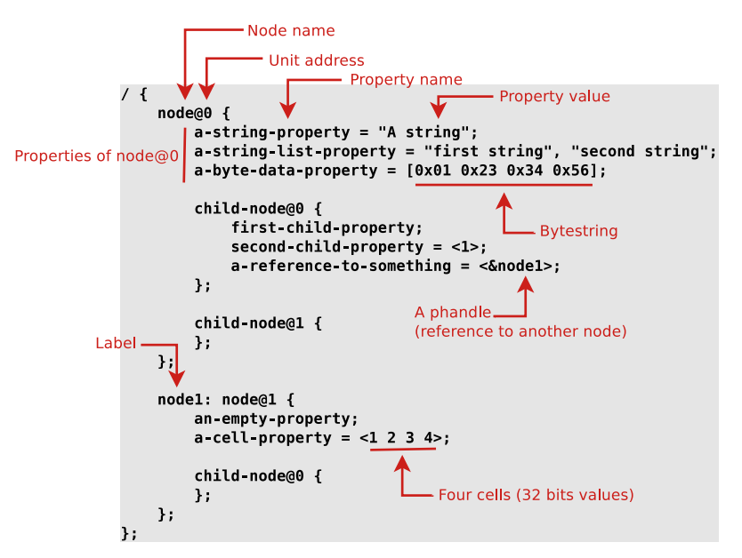
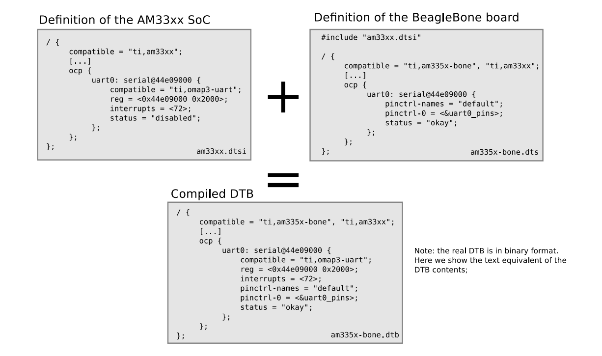

# Device tree - Linux Kernel
This Markdown was adapted from ["Device Tree: Hardware description for everybody!" - Thomas Petazzoni"](https://bootlin.com/pub/conferences/2020/lee/petazzoni-dt-hw-description-everybody/petazzoni-dt-hw-description-everybody.pdf).
## Discoverability Mechanisms in Hardware Buses

### Discoverable Buses

Some hardware buses provide discoverability mechanisms, allowing devices to be detected and configured at runtime without prior knowledge of their connection. Example:
- PCI
- USB

### Non-Discoverable Buses
Many hardware buses do not provide discoverability mechanisms, meaning that the system needs to be pre-configured with knowledge of what devices are connected and how they are connected. Example:
- I2C
- SPI
- Memory-Mapped buses

### Methods for Describing Hardware in Systems 
1. Directly in the OS/Bootloader Code: Hardware descriptions are directly embedded in the operating system or bootloader code, typically using compiled data structures written in C.
2. Using ACPI tables: tables provided by the firmware.

3. Device Tree.

### Device Tree
Device Tree is a data structure used to describe the hardware components of a system. It provides an OS-agnostic method for representing the hardware platform, ensuring that the operating system or bootloader can interact correctly with the underlying hardware. 
- Device Tree Source File (`.dts`): Human-readable and organized in a hierarchical tree structure that represents the hardware layout.
- Device Tree Blob (`.dtb`): The `.dts` is compiled in binary format `.dtb` using the _Device Tree Compiler_ `.dtc`.


### Syntax
The Device Tree structure is based on a tree of nodes, where each node represents a device or an IP block. Nodes are defined with various properties that describe the characteristics of the hardware. 
- Nodes: Typically represents a device or an IP block. Each node is identified by a **node name** and may include a **unit address** to distinguish between instances of the same device type.
- Properties: Define the characteristics of the device that the node represents. Each property consists of a **property name** and **property value**. Properties can store different types of values, such string, arrays, etc.
- Labels: Nodes or properties can be labeled for easier referencing in the Device Tree structure. Use for referring to a node or property from another part of the Device Tree.

<p align="center">
  <br>
  <em>Fig. Syntax</em>
</p>


### Location of Device Tree Sources

Although Device Tree sources are designed to be operating system-agnostic, there isn't a central, OS-Neutral repository to host and share these files across different projects. This has been a topic of discussion, butno universal solution has been implemented.

- Canonical Location: In practice, the Linux Kernel source tree is often considered the primary location for Device Tree Source (`.dts`) files. Within the Linux kernel, these files are typically located in the `arch/<ARCH>/boot/dts` directory. 

- Current Scale: As of Linux kernel version 5.10, there are approximately 4700 Device Tree Source files within the Linux repository.

- Duplication Across Projects: These Device tree source files are often duplicated or synchronized across various projects, including U-Boot/ Barebox, to ensure compatibility and consistency.

### Device Tree Inheritance

Device Tree (DT) files are designed to be modular and not monolithic, allowing them to be split into multiple files that can include one another. This modularity enhances maintainability and reusability across different hardware platforms.

File Types:
- `.tdsi`: These are included files that typically contain definitions at the SoC (System on Chip) level or other common configurations that can be shared across multiple boards.
These files are often reused across similar boards to avoid duplication of common settings.
- `.dts`: These are the final Device Tree files represent the specific configuration of a board. Include the necessary `.dtsi` files and provide board-level details.

Compilation:
- Only `.dts` files are accepted as input by the Device Tree Compiler (`dtc`). The compiler processes these files to generate the final binary Device Tree Blob (`.dtb`).

Inclusion Mechanism:
- The inclusion of `.dtsi` files into `.dts` files works by overlaying the tree structure of the including file over the tree of the included file.
- This is done using the C pre-processor's `#include` directive, allowing hierarchical and reusable hardware descriptions.

C Pre-processor Usage:
- The C pre-processor is also employed to use `#define` directives, enabling the replacement of hardcoded values with human-readable definitions. This further enhances readability and maintainability.

<p align="center">
  <br>
  <em>Fig. Example</em>
</p>

### Device Tree Overlays

The Device Tree Overlays provide a dynamic way to modify or extend the base Device Tree to accommodate additional hardware components or configurations.

A Device Tree Overlay is a small snippet of a Device Tree that functions like a patch to the main DT. It is used to describe additional devices or modify existing ones without altering the original DT.

U-boot supports applying DT overlays. No support in Linux for applying DT overlays however.

Example: Examples: https://github.com/raspberrypi/linux/tree/rpi5.4.y/arch/arm/boot/dts/overlays/


### Device Tree binding: Styles

***Old style***

```
I2C for Atmel platforms
Required properties :
- compatible : Must be one of:
"atmel,at91rm9200-i2c",
"atmel,at91sam9261-i2c",
"atmel,at91sam9260-i2c",
"atmel,at91sam9g20-i2c",
"atmel,at91sam9g10-i2c",
"atmel,at91sam9x5-i2c",
"atmel,sama5d4-i2c",
"atmel,sama5d2-i2c",
"microchip,sam9x60-i2c".
- reg: physical base address of the controller and length of memory mapped
region.
- interrupts: interrupt number to the cpu.
- #address-cells = <1>;
- #size-cells = <0>;
- clocks: phandles to input clocks.
Optional properties:
- clock-frequency: Desired I2C bus frequency in Hz, otherwise defaults
to 100000
- dmas: A list of two dma specifiers, one for each entry in
dma-names.
- dma-names: should contain "tx" and "rx".
- scl-gpios: specify the gpio related to SCL pin
- sda-gpios: specify the gpio related to SDA pin
[...]
```

```
Examples :
i2c0: i2c@fff84000 {
compatible = "atmel,at91sam9g20-i2c";
reg = <0xfff84000 0x100>;
interrupts = <12 4 6>;
#address-cells = <1>;
#size-cells = <0>;
clocks = <&twi0_clk>;
clock-frequency = <400000>;
24c512@50 {
compatible = "atmel,24c512";
reg = <0x50>;
pagesize = <128>;
}
```

***YAML style***

```yaml
# SPDX-License-Identifier: (GPL-2.0 OR BSD-2-Clause)
# Copyright 2019 BayLibre, SAS
%YAML 1.2
---
$id: "http://devicetree.org/schemas/i2c/amlogic,meson6-i2c.yaml#"
$schema: "http://devicetree.org/meta-schemas/core.yaml#"
title: Amlogic Meson I2C Controller
maintainers:
- Neil Armstrong <narmstrong@baylibre.com>
- Beniamino Galvani <b.galvani@gmail.com>
allOf:
- $ref: /schemas/i2c/i2c-controller.yaml#
properties:
compatible:
enum:
- amlogic,meson6-i2c # Meson6, Meson8 and compatible SoCs
- amlogic,meson-gxbb-i2c # GXBB and compatible SoCs
reg:
maxItems: 1
interrupts:
maxItems: 1

clocks:
minItems: 1
required:
- compatible
- reg
- interrupts
- clocks
unevaluatedProperties: false
examples:
- |
  i2c@c8100500 {
  compatible = "amlogic,meson6-i2c";
  reg = <0xc8100500 0x20>;
  interrupts = <92>;
  clocks = <&clk81>;
  #address-cells = <1>;
  #size-cells = <0>;
    eeprom@52 {
    compatible = "atmel,24c32";
    reg = <0x52>;
    };
  };
```

### Device Tree Design Principles

1. *Describing Hardware, Not Configuration:*
The primary role of the DT is to describe the hardware as it is, rather than how the hardware is configured or utilized. This ensures that the DT remains a consistent representation of the hardware, independent of specific configurations or use cases.

2. *Operating System Agnostic:* A well-designed DT is OS-agnostic, meaning that the same DT should work across different operating systems such as U-boot, FreeBSD, Linux.
There should be no need to modify the DT when upgrading or switching operating systems, ensuring long-term compatibility and maintainability.

3. *Describing Integration, Not Internals:* The DT focuses on describing the integration of hardware components, rather than the internal workings of each component. Details of how a specific device or IP block functions internally are managed by the device drivers in the operating system. The DT specifies how devices are connected and interact with the rest of the system, including aspects like IRQ lines, DMA channels, clocks, reset lines.

### `Compatible` Property
This is a list of strings that describe the compatibility of a device with specific drivers or bindings. Strings are ordered from the most specific to the least specific, helping the operating system or firmware identify the correct driver for the device.

The property defines the specific binding to which the node complies, essentially describing the device's programming model. Practically, is used by the OS to find and load the appropriate driver for the device.

Example:
```
compatible = "arm,armv8-timer";
compatible = "actions,s900-uart", "actions,owl-uart";
compatible = "regulator-fixed";
compatible = "gpio-keys";
```

### `Common` Properties

- `reg`: Memory-mapped devices (base address and size of the registers). I2C devices. SPI devices.
- `interrupts, interrupt-parent, interrupts-extended`: interrupt lines used by the device, and which interrupt controller they are conected to.
- `clocks`: which clock are used by the device from which clock controller.
- `dmas`: which DMA controller and channels are used by the device.
-`status`: `okay` means the device is present and should be enabled, otherwise, the device is left unused.
-`pinctrl-*`: indicates the pin-muxing configuration requested by the device.

### `Cells` concept

- 32-bit Integers: in DT, integer values are represented as 32-bit integers, which are referred to as cells.
- 64-bit values: To encode a 64-bit value, two cells are used.

Important Cell properties:
- `#address-cells and #size-cells`: These properties define how many cells are used in sub-nodes to encode the address and size in the reg property.

```yaml
soc {
  compatible = "simple-bus";
  #address-cells = <1>;
  #size-cells = <1>;
  i2c@f1001000 {
    reg = <0xf1001000 0x1000>;
    #address-cells = <1>;
    #size-cells = <0>;
    eeprom@52 {
      reg = <0x52>;
    };
  };
};
```

- `#interrupt-cells`:
Specifies the number of cells used to encode interrupt specifiers for a given interrupt controller.

```yaml
soc {
  intc: interrupt-controller@f1002000 {
    compatible = "foo,bar-intc";
    reg = <0xf1002000 0x1000>;
    interrupt-controller;
    #interrupt-cells = <2>;
  };
  i2c@f1001000 {
    interrupt-parent = <&intc>;
    /* Must have two cells */
    interrupts = <12 24>;
  };
};
```

- Additional Cell Properties `#clock-cells` `#gpio-cells` `#phy-cells` `#pwm-cells` `#dma-cells`

```yaml
soc {
  clkc: clock@f1003000 {
    compatible = "foo,bar-clock";
    reg = <0xf1003000 0x1000>;
    #clock-cells = <3>;
  };
  i2c@f1001000 {
    /* Must have three cells */
    clocks = <&clkc 12 24 32>;
  };
};

```

### `-names` Properties

Some properties are associated to a corresponding `<prop>-names` property. Gives some human-readable names to entries of the corresponding <prop> properties.

Such names can be typically be used by the driver.

```yaml
interrupts = <0 59 0>, <0 70 0>;
interrupt-names = "macirq", "macpmt";
clocks = <&car 39>, <&car 45>, <&car 86>, <&car 87>;
clock-names = "gnssm_rgmii", "gnssm_gmac", "rgmii", "gmac";
```
*platform_get_irq_byname(pdev, "macirq");*
