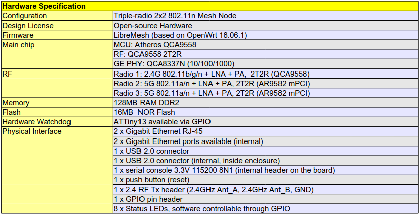
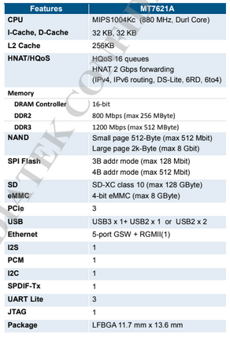

# LibreRouter 1 y 2 - KDT

# Resumen 

En este docuemento se lleva a cabo un desarrollo teórico/práctico analizando los kdt del librerouter v1, que luego entrará en comparación y será de utilidad para definir el kdt del librerouter v2 con el objetivo de establecer las direcciones de memoria correctas para desarrollar el safe-upgrade.

# LibreRouter 1

En principio se observa el datasheet del librerouter v1 y su main chip.

<p align="center">
  <br>
  <em>Fig. Datasheet LibreRouter1.</em>
</p>

Se puede apreciar que la memoria flash es de 16MB. Ahora nos enfocamos en el kdt activo en la versión actual de OpenWrt. En el correspondiente `.dtsi` sobre la flash solamente tiene direcciones de inicio y campos base:

```dts
spi: spi@1f000000 {
        	compatible = "qca,ar934x-spi";
        	reg = <0x1f000000 0x1c>;

        	clocks = <&pll ATH79_CLK_AHB>;

        	status = "disabled";

        	#address-cells = <1>;
        	#size-cells = <0>;
    	};
```

Y en el `.dts` del librerouter específicamente, se observa la definición de las particiones.

```dts
&spi {
	status = "okay";

	flash@0 {
		compatible = "jedec,spi-nor";
		reg = <0>;
		spi-max-frequency = <25000000>;

		partitions {
			compatible = "fixed-partitions";
			#address-cells = <1>;
			#size-cells = <1>;

			partition@0 {
				label = "u-boot";
				reg = <0x000000 0x040000>;
				read-only;
			};

			partition@40000 {
				label = "u-boot-env";
				reg = <0x040000 0x010000>;
			};

			partition@50000 {
				compatible = "denx,uimage";
				label = "firmware";
				reg = <0x050000 0x7c0000>;
			};

			partition@810000 {
				label = "fw2";
				reg = <0x810000 0x7d0000>;
			};

			partition@fd0000 {
				label = "res";
				reg = <0xfd0000 0x20000>;
			};

			art: partition@ff0000 {
				label = "art";
				reg = <0xff0000 0x010000>;
				read-only;

				nvmem-layout {
					compatible = "fixed-layout";
					#address-cells = <1>;
					#size-cells = <1>;

					macaddr_art_0: macaddr@0 {
						reg = <0x0 0x6>;
					};

					macaddr_art_6: macaddr@6 {
						reg = <0x6 0x6>;
					};

					macaddr_art_c: macaddr@c {
						reg = <0xc 0x6>;
					};
				};
			};
		};
	};
};
```


De manera mas clara: 

| **Tag-Name** | **Inicio** | **Tamaño** |
|--------------|------------|------------|
| u-boot       | 0x000000   | 0x040000   |
| u-boot-env   | 0x040000   | 0x010000   |
| firmware     | 0x050000   | 0x7C0000   |
| fw2          | 0x810000   | 0x7D0000   |
| res          | 0xFD0000   | 0x20000    |
| art          | 0xFF0000   | 0x010000   |


Sumando todos los tamaños, se usan `16MB` que habíamos observado anteriormente es el tamaño de la flash disponible.

# LibreRouter 2

Ahora investigamos las características del core integrado en el LibreRouter v2.

<p align="center">
  <br>
  <em>Fig. Datasheet LibreRouter2.</em>
</p>

La definición de la SPI Flash en este caso especifica bits de direccionamiento, donde para `3B` la capacidad de la flash es `128MBit` es decir `16MB`, y para `4B`, `512MBit - 64MB`. De la misma manera veamos los datos del  .dts en la versión de OpenWrt.

| **Tag/Name** | **Inicio** | **Tamaño**  |
|--------------|------------|-------------|
| u-boot       | 0x0        | 0x30000     |
| u-boot-env   | 0x30000    | 0x10000     |
| factory      | 0x40000    | 0x10000     |
| firmware     | 0x50000    | 0x1fb0000   |


# Comparativa entre los datos de ambos dispositivos

| **Tag-Name**  | **LibreRouter v1 - Inicio** | **LibreRouter v1 - Tamaño** | **LibreRouter v2 - Inicio** | **LibreRouter v2 - Tamaño** |
|---------------|-----------------------------|-----------------------------|-----------------------------|-----------------------------|
| u-boot        | 0x000000                    | 0x040000                    | 0x0                         | 0x30000                     |
| u-boot-env    | 0x040000                    | 0x010000                    | 0x30000                     | 0x10000                     |
| factory       | N/A                         | N/A                         | 0x40000                     | 0x10000                     |
| firmware      | 0x050000                    | 0x7C0000                    | 0x50000                     | 0x1fb0000                   |
| fw2           | 0x810000                    | 0x7D0000                    | N/A                         | N/A                         |
| res           | 0xFD0000                    | 0x20000                     | N/A                         | N/A                         |
| art           | 0xFF0000                    | 0x010000                    | N/A                         | N/A                         |


